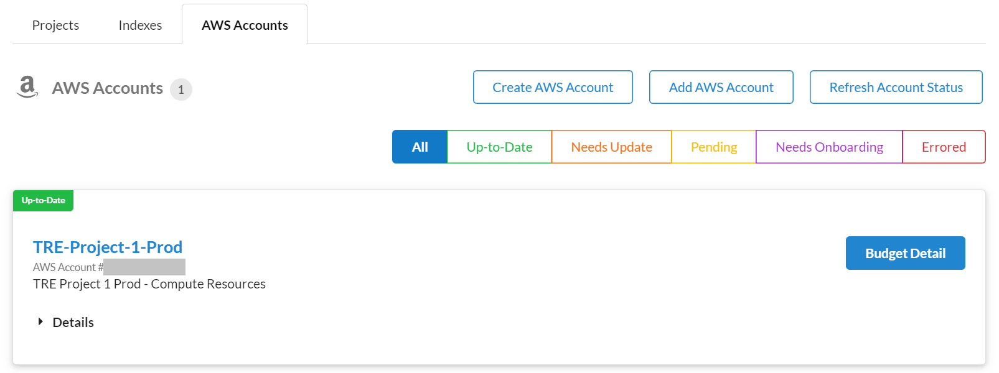

Ensure all steps below are executed in AWS region: [London (eu-west-2)](https://eu-west-2.console.aws.amazon.com/).

## Step 2. Deploy ServiceWorkbench

**Time to deploy**: Approximately 75 minutes

### Step 2A. Log in to the EC2 instance

- [ ] Follow these [instructions](https://docs.aws.amazon.com/AWSEC2/latest/UserGuide/session-manager.html) to learn how to connect via SSM to the EC2 instance created in Step 1.
- [ ] Run the following command to log in and initialise your environment:
```
sudo -iu ec2-user
```

### Step 2B. Download ServiceWorkbench

- [ ] Run the following commands to get a copy of the open-source software called ServiceWorkbench (SWB):
```
cd /home/ec2-user/tmp
wget https://github.com/awslabs/service-workbench-on-aws/archive/refs/tags/v5.1.0.tar.gz
tar -xzf v5.1.0.tar.gz
```

### Step 2C. Create configuration file

- [ ] Run the following commands to create a configuration file for SWB:
```
cd /home/ec2-user/tmp/service-workbench-on-aws-5.1.0/main/config/settings
cp .defaults.yml treprod.yml
nano treprod.yml
```

Inside the `treprod.yml` file, change the parameters below as instructed and then save the file.

- [ ] Add:
```
awsRegion: eu-west-2
solutionName: pj1
rootUserName: <replace this with TRE project IT admin's username>
rootUserFirstName: <replace this with TRE project IT admin's first name>
rootUserLastName: <replace this with TRE project IT admin's last name>
rootUserEmail: <replace this with valid TRE project IT admin email address>
enableEgressStore: true
isAppStreamEnabled: true
```

- [ ] Remove:
```
versionNumber: '5.1.0'
versionDate: '2022-03-22'
```

Note: Remove the versionNumber and versionDate in the configuration file every time you need to run Step 2E. This is a fix for an issue in SWB in which a script fails when these 2 parameters are set.

### Step 2D. Run installation script

**Time to deploy**: Approximately 15 minutes

- [ ] Run the following commands to install SWB:
```
cd /home/ec2-user/tmp/service-workbench-on-aws-5.1.0
./scripts/environment-deploy.sh treprod
```

### Step 2E. Build Workspace AMIs

**Time to deploy**: Approximately 15 minutes

- [ ] Run the following commands to install the required packer package:
```
sudo yum install -y yum-utils
sudo yum-config-manager --add-repo https://rpm.releases.hashicorp.com/AmazonLinux/hashicorp.repo
sudo yum -y install packer
```

- [ ] Run the following commands to build the default SWB workspace images:
```
cd /home/ec2-user/tmp/service-workbench-on-aws-5.1.0/main/solution/machine-images
pnpx sls build-image -s treprod
```

### Step 2F. Setup AppStream

**Time to deploy**: Approximately 30 minutes

> Currently set to default instructions and image provided by SWB

#### Part 1
- [ ] Run the following commands to create an image builder in AppStream:
```
cd /home/ec2-user/tmp/service-workbench-on-aws-5.1.0/scripts/app-stream
npm install
npm audit fix
npm run start-image-builder -- default eu-west-2 default default
```

#### Part 2

Log in to the [AWS Management Console](https://console.aws.amazon.com/) using your **TRE Project 1 Prod** account and Admin privileges.

- [ ] Go to Service: [AWS AppStream](https://eu-west-2.console.aws.amazon.com/appstream2/home?region=eu-west-2)
- [ ] Select menu option *Images* -> [*Image builder*](https://eu-west-2.console.aws.amazon.com/appstream2/home?region=eu-west-2#/image-builder)
- [ ] Select the image builder created in Part 1 above, then press on button *Connect*
- [ ] On the new tab page that opened in your browser, log in as *Administrator*
- [ ] On the Windows Desktop provided by AppStream, press on the Start button and right click on Windows Powershell to select *Run as administrator*
- [ ] Run the following commands in Windows Powershell to create an AppStream image:
```
cd ~\Documents
Invoke-WebRequest -Uri https://raw.githubusercontent.com/awslabs/service-workbench-on-aws/v5.1.0/scripts/app-stream/buildImage.ps1 -OutFile buildImage.ps1
.\buildImage.ps1
```

You can view the image created in AppStream's menu option: [*Image registry*](https://eu-west-2.console.aws.amazon.com/appstream2/home?region=eu-west-2#/images).

### Step 2G. Onboard Account

**Time to deploy**: Approximately 10 minutes

- [ ] Run the following commands to get the web link for SWB:
```
cd /home/ec2-user/tmp/service-workbench-on-aws-5.1.0
./scripts/get-info.sh treprod
```
- [ ] Copy the value for *Website URL* and open the browser to access the page
- [ ] Log in using the *rootUserEmail* user set in the configuration file in step 2C. For the first time login, use the temporary password received in an email. Alternatively, use the password shown in the get-info.sh output under *Temporary Native Pool Password*
- [ ] In the SWB website, select *Accounts* on the left side menu
- [ ] Select *AWS Accounts* and press on button *Add AWS Account*. Some of the settings are adjustable (e.g. time limits, instance type). Below you can find suggested values:
```
Account Name: TRE-Project-1-Prod
AWS Account ID: <The ID for the TRE Project 1 Prod account>
Description: TRE Project 1 Prod - Compute Resources
External ID: workbench
AppStream Fleet Desired Instance: 5
AppStreamDisconnectTimeoutSeconds: 3600
AppStreamIdleDisconnectTimeoutSeconds: 3600
AppStreamMaxUserDurationSeconds: 3600
AppStreamImageName: <The image built in step 2F - Part 2>
AppStreamInstanceType: stream.standard.small
AppStreamFleetType: ON_DEMAND
```
- [ ] Press on button *Onboard AWS Account* and follow all remaining instructions on the web page
- [ ] Confirm the account status matches the image below


