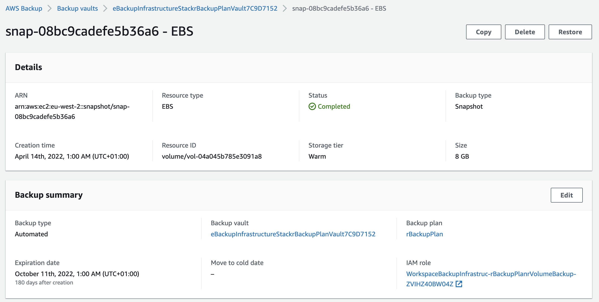
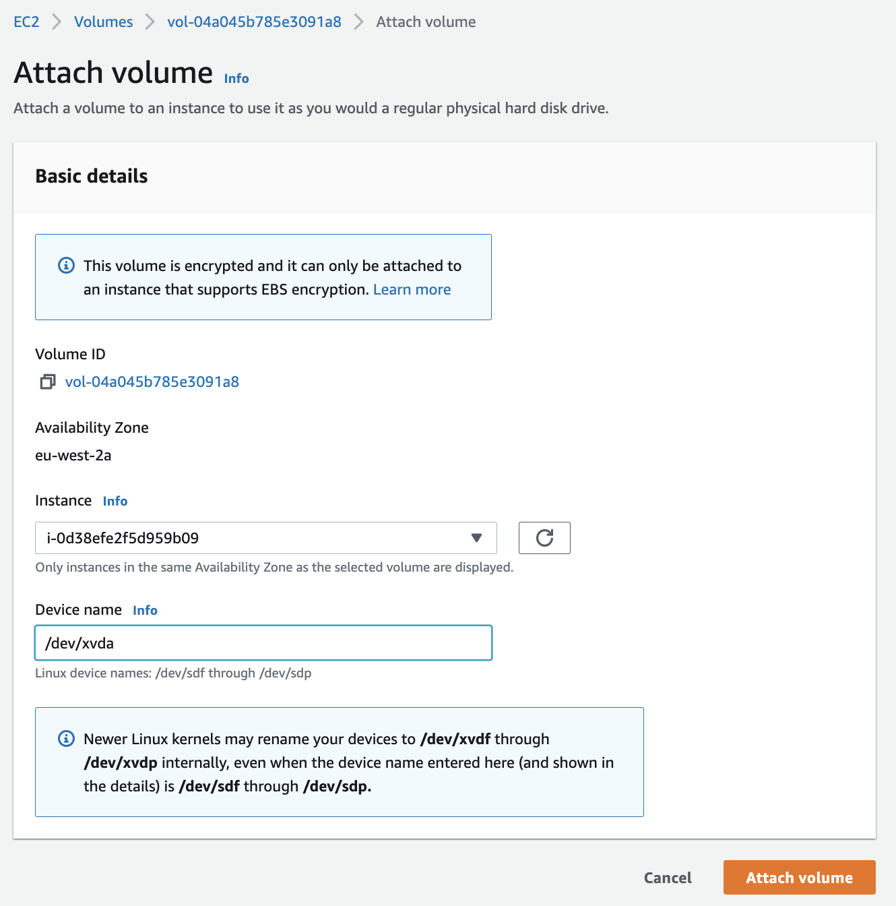

# Workspace Backup

Workspace backups is an optional component of TRE setup.
When installed, it allows TRE administrators to schedule data
backups for both EC2 based and Sagemaker notebook based workspaces.

The infrastructure for this component is implemented using [AWS CDK v2](https://docs.aws.amazon.com/cdk/v2/guide/home.html).
Ensure all steps below are executed in AWS region: [London (eu-west-2)](https://eu-west-2.console.aws.amazon.com/).

## Design

Below diagrams explain how the backup solution works
for

EC2 based workspaces.


SageMaker notebook based workspaces


## Step 6. Deploying Workspace Backup Component

---

**Time to deploy**: Approximately 15 minutes

Apply these steps only to accounts part of the **TRE Projects Prod** OU.

Log in to the [AWS Management Console](https://console.aws.amazon.com/)
of your **TRE Account** with Administrative privileges.

The EC2 instance would already be created as part of previous
steps for installing the TRE setup and the source code already downloaded.

### Step 6A. Log in to the EC2 instance

- [ ] Follow these [instructions](https://docs.aws.amazon.com/AWSEC2/latest/UserGuide/session-manager.html)
  to learn how to connect via SSM to the EC2 instance created in Step 1.
- [ ] Run the following commands to initialise your environment:

```console
sudo su ec2-user
source ~/.bash_profile
```

### Step 6B. Deploy backend infrastructure

- [ ] Update `cdk.json` file to meet your requirements. Below are
      the options available

|Parameter|Usage|Default Value|Notes|
|---------|-----|-------------|-----|
|frequency|controls the frequency of taking backups. possible values are daily and hourly|daily|For sagemaker notebook instance needs to be running for the backup to happen. This might not always be the case so a backup is also taken when instance is started|
|retention_period|defines the number of days backup is retained before deletion|180||
|move_to_cold_storage_after|defines the number of daya after which is backup is archived to cold storage|90|AWS Backup for EBS currently does not support this. Uses S3 lifecycle policy for Sagemaker backups|
|sagemaker_enable_selfservice_restore|controls if SageMaker notebook user is able to restore backedup files|true||

- [ ] Change directory to root folder of the backup component code.

- [ ] Run the following commands to create an isolated Python environment and deploy the CDK stack:

```console
python3 -m venv .venv
source .venv/bin/activate
pip3 install -r requirements.txt
pip3 install -r ./src/lambda_layer/requirements.txt --target ./src/lambda_layer/python
alias cdk2="npx aws-cdk@2.x"
cdk2 deploy
```

### Step 6C. Workspace Configuration Update

---

Once the component is deployed, the TRE administrator
needs to add specific tag to workspace configurations to
make backup enabled workspaces available to the researchers.

Note that the cost associated with a backup enabled workspace
will be higher compared to the one without backups as the storage
of backups will be added.

The below steps provide an illustration of enabling
backups for a workspace.

1. Login to the TRE Web App as a TRE admin.

1. Navigate to `Workspace Types`

1. Click `Edit` for one of the approved workspace types for
   which you want to enable backups.

1. Click on `Configurations` tab, and clone an existing workspace
   configuration. Update the id, name and description of the workspace.
   

1. In the last step add the backup tag as shown in screenshot.
   If you changed the backup tag value in `cdk.json` the same should
   go in here.
   

1. Click `Done`. The workspace with backup configuration
   should now be available to researchers to create.

### Step 6D. Validating Workspace Backups

---

This section is intended for TRE admins to ensure
that the backup functionality is working as expected.
The steps only need to be performed once after initial setup.

Currently the validation is done only after a workspace of
each type is created by researcher. Alternatively the TRE
Admin can create new workspace just for validation of
this functionality.

### Validating EBS volume backups

1. Login into the TRE Web App as an Admin.
   Navigate to `Workspaces`. In  the list of
   all Available and Stopped workspaces check for a workspace
   based on EC2 and has been created using a configuration
   that has backup enabled.

1. Once such workspace is identified, click on `View Detail`
   , navigate to `CloudFormation Output` and note `Ec2WorkspaceInstanceId`

   *Note : You need to wait for the backup window to pass before
   performing below steps. For Daily backup frequency wait for a day
   and for hourly back frequency wait for atleast a few hours to pass.*

1. Log in to the [AWS Management Console](https://console.aws.amazon.com/)
   of the TRE account using Admin privileges. Navigate to EC2 console.

1. Go to instances and search using instance id.

1. Click on the instance id, navigate to storage tab and click on
   the volume-id attached to the EC2 instance.

1. This should re-direct to EBS Volumes page with the list pre-filtered.
   Click on the volume-id again, navigate to Tags and confirm that a tag
   with Key `backupVolume` and Value `true` is present.

1. Now navigate to AWS Backup console. Click on `Protected resources`
   and confirm that the volume-id noted earlier appears there.

### Validating Sagemaker Notebook backups

1. Login into the TRE Web App as an Admin.
   Navigate to `Workspaces`. In  the list of
   all Available and Stopped workspaces check for a workspace
   based on SageMaker Notebook and has been created using a configuration
   that has backup enabled.

1. Once such workspace is identified, click on `View Detail`
   , navigate to `CloudFormation Output` and note `NotebookInstanceName`

   *Note : You need to wait for the backup window to pass before
   performing below steps Or the workspace to be restarted once
   after files have been created in it.*

1. Log in to the [AWS Management Console](https://console.aws.amazon.com/)
   of the TRE account using Admin privileges. Navigate to S3 console.

1. Click on the S3 bucket that has name similar to
   `sagemeker-backup-bucket-ACCOUNTNUMBER-eu-west-2`

1. Click on the bucket to view its content.
   There should be a S3 prefix with the `NotebookInstanceName`
   that was noted down earlier.

1. Click on the prefix corresponding to notebook instance
   name and check that the expected files are uploaded here.

## Restoring Workspace Backups

---

This section is intended for TRE admins to enable
them to restore workspace backups when requested
by a researcher.

### Restoring EBS volume

**Time to restore**: Approximately 15 minutes

EBS volume backup are created for Workspaces backed by
EC2 compute. There are multiple ways in which files from
an EBS can be restored, this guide only explain restoring
EBS by replacing it on the Workspace.

1. The workspace that needs to be restored must be in stopped state.
   This can be done by Researcher or Admin from the TRE Web App.
1. TRE Admin should have the workspace instance id handy for completing these steps.
1. Log in to the [AWS Management Console](https://console.aws.amazon.com/)
   of the TRE account using Admin privileges.

1. Navigate to the EC2 console, filter Instances with the instance id
   for which the restore needs to be carried out and click the
   instance id

1. Navigate to `Networking` tab and note `Availability zone`.
   The EBS volume needs to be restored to the same Availability zone
   in which the EC2 instance is placed.

1. Navigate to `Storage` tab and note `Volume ID`, `Device name`, and `Volume size (GiB)`

1. Click on the `Volume ID` which should take you to `volumes` page, select
   the volume, click on `Action`->`Detach volume`, confirm `Detach`

      *Note : At this point if the detached volume is no longer required it should be deleted.*

1. Navigate to `AWS Backup` console, navigate to `Backup vaults`
   , click on the vault name.

1. Use the `Volume ID` to search backups. Based on the backup frequency
   there
   will be multiple recovery points.
   Select the most appropriate
   recovery point.

1. After identifying the restore point to restore the EBS volume,
   click on the recovery point ARN and select the Restore button.
   

1. The restore of the ARN will bring you to a Restore backup screen
   that will have the snapshot ID, and other configurations.
   Fill the details as per below table and click on `Restore backup` button.

      |Parameter|Value|
      |----|----|
      |Resource Type| Specify EBS volume.|
      |Volume type| Select General Purpose SSD (gp2).|
      |Size| Select equivalent size of the backed up EBS volume as noted earlier.|
      |IOS| 300/3000 - Baseline of 3 iops per GiB with a minimum of 100 IOPS, burstable to 3000 IOPS.|
      |Availability Zone| Select the Availability Zone
      for the EC2 instance as noted in previous step|
      |Restore role| Select Default role|

1. This will take you to restored jobs screen.
   The restored backup job will appear under Restore jobs in the the AWS Backup console.
   Once the job status appears as completed, note the
   volume id of the restored volume.
   

1. Navigate to the Amazon EC2 console, select Volumes under
   Elastic Block Store to see the restored EBS volumes.

1. Select the volume, click on `Action`->`Attach volume`, select the correct
   `Instance` from the drop down and provide
   the `Device name` as noted in previous step.
   

1. The restored volume should now be attached to the
   EC2 instance. The researcher or admin should now be able to start
   the Workspace.

1. Once the EC2 instance is in Running state, the TRE admin should
   verify that a tag with name `backupVolume` and value `true`
   should be added to the newly restored volume.

### Restoring SageMaker files

SageMaker notebook files are backed up to Amazon S3 bucket.
A prefix for each workspace is created in the Backup bucket
and files corresponding to each workspace are uploaded
to it's corresponding prefix in S3.

The bucket has versioning enabled so user can restore a specific
version of file if required.

#### **Self-service**

**Time to restore**: Approximately 15 minutes

TRE user can follow these steps for restoring the files
if TRE administrator has
enabled self-service for restore while installing the backup component.

1. TRE user or admin logs into the SageMaker notebook. Keep notebook instance name
   handy.

1. TRE user or admin opens `Terminal` using File -> New -> Terminal

1. Use [list-objects](https://docs.aws.amazon.com/cli/latest/reference/s3api/list-objects.html)
   aws cli command to list objects available to restore.

   Example

   ```console
   aws s3api list-objects --bucket sagemeker-backup-bucket-AWSACCOUNTNUMBER-eu-west-2 --prefix NOTEBOOK_NAME/
   ```

1. Identify the object that you want to restore from the list.
   Use [get-object](https://docs.aws.amazon.com/cli/latest/reference/s3api/get-object.html)
   aws cli command to restore the file.

   Example

   ```console
   aws s3api get-object --bucket sagemeker-backup-bucket-AWSACCOUNTNUMBER-eu-west-2 --key NOTEBOOK_NAME/FILE_NAME FILE_NAME
   ```

   By default the above command will restore
   the latest version of the file. Optionally, the user can also pass `--version-id`
   parameter to restore a specific version of the file.

#### **TRE Admin**

**Time to restore**: Approximately 15 minutes

If the TRE Admin has not enabled self service to restore
files the restoration work needs to be undertaken by the TRE Admin.

1. Log in to the [AWS Management Console](https://console.aws.amazon.com)
   of your **TRE Account** with Administrative privileges.

1. Navigate to Amazon SageMaker console. Click on Notebook -> Notebook instances.
   Click on Notebook name on which files need to be restored.

1. Under Permissions and encryption click on the IAM role ARN.

1. This will re-direct to IAM console. Click Add permissions -> Create inline policy

1. Switch to JSON view and paste below policy
   to enable permissions to restore files from S3 bucket.
   Replace values for `BACKUP_BUCKET` and `NOTEBOOK_NAME` variables.

   ```json
      {
         "Version": "2012-10-17",
         "Statement": [
            {
                  "Effect": "Allow",
                  "Action": ["s3:ListBucket"],
                  "Resource": [
                     "arn:aws:s3:::BACKUP_BUCKET/NOTEBOOK_NAME"
                  ],
                  "Condition": {
                     "StringEquals": {
                        "s3:prefix": "NOTEBOOK_NAME"
                     }
                  }
            },
            {
                  "Effect": "Allow",
                  "Action": [
                     "s3:GetObject",
                     "s3:GetObjectVersion"
                  ],
                  "Resource": [
                     "arn:aws:s3:::BACKUP_BUCKET/NOTEBOOK_NAME/*"
                  ],
            },
         ],
      }
   ```

1. Click on Review Policy. Provide policy name as `sagemaker-restore-policy-for-NOTEBOOK_NAME`
   after replacing NOTEBOOK_NAME with actual value.
   Click on Create Policy.

The above set of steps enables the IAM permissions for performing
restore activity.
Follow the self-service steps to restore necessary files.

Once restoration work is completed, TRE Admin should delete the
inline policy added earlier. Failure to do so will result is errors
while terminating the Sagemaker Notebook workspace as CloudFormation
will not be able to delete the IAM role associated with the Notebook.

## References

---

- <https://docs.aws.amazon.com/aws-backup/latest/devguide/whatisbackup.html>
- <https://aws.amazon.com/getting-started/hands-on/amazon-ebs-backup-and-restore-using-aws-backup/>
- <https://docs.aws.amazon.com/sagemaker/latest/dg/notebook-lifecycle-config.html>
