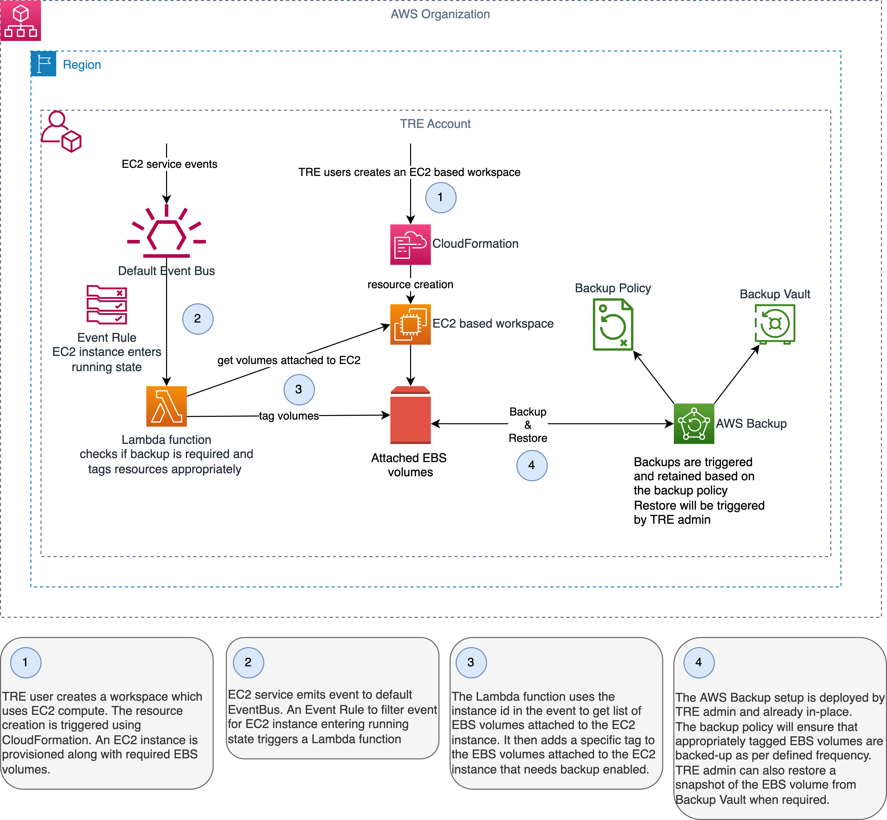

# Workspace Backup

Workspace backups is an optional component of TRE setup.
When installed, it allows TRE administrators to schedule data
backups for both EC2 based and SageMaker notebook based workspaces.

The infrastructure for this component is implemented using [AWS CDK v2](https://docs.aws.amazon.com/cdk/v2/guide/home.html).
Ensure all steps below are executed in AWS region: [London (eu-west-2)](https://eu-west-2.console.aws.amazon.com/).

## Design

Below diagrams explain how the backup solution works
for

1. EC2 based workspaces.


1. SageMaker notebook based workspaces


## Step 6. Deploying Workspace Backup Component

---

**Time to deploy**: Approximately 15 minutes

Apply these prerequisites only to accounts that are part of the **TRE Projects Prod** OU.

Log in to the [AWS Management Console](https://console.aws.amazon.com/)
of your **TRE Account** with Administrative privileges.

The EC2 instance would already be created as part of previous
steps for installing the TRE setup and the source code already downloaded.

### Step 6A. Log in to the EC2 instance

- [ ] Follow these [instructions](https://docs.aws.amazon.com/AWSEC2/latest/UserGuide/session-manager.html)
  to learn how to connect via SSM to the EC2 instance created in Step 1.
- [ ] Run the following commands to initialise your environment:

```console
sudo -iu ec2-user
alias cdk2="npx aws-cdk@2.x"
```

### Step 6B. Deploy backend infrastructure

- [ ] Update `cdk.json` file to meet your requirements. Below are
      the options available

|Parameter|Usage|Default Value|Notes|
|---------|-----|-------------|-----|
|frequency|controls the frequency of taking backups. possible values are daily and hourly|daily|For SageMaker notebooks, the instance needs to be running for the backup to happen. This might not always be the case so a backup is also taken when instance is started|
|retention_period|defines the number of days backup is retained before deletion|180||
|move_to_cold_storage_after|defines the number of days after which the backup is archived to cold storage|90|AWS Backup for EBS currently does not support this. Uses S3 lifecycle policy for SageMaker backups|
|sagemaker_enable_selfservice_restore|controls if SageMaker notebook user is able to restore backed-up files|true||

- [ ] Change directory to root folder of the backup component code.

- [ ] Run the following commands to create an isolated Python environment and deploy the CDK stack:

```console
python3 -m venv .venv
source .venv/bin/activate
pip3 install -r requirements.txt
pip3 install -r ./src/lambda_layer/requirements.txt --target ./src/lambda_layer/python
cdk2 deploy
```

### Step 6C. Validating Workspace Backups

---

This section is intended for TRE admins to ensure
that the backup functionality is working as expected.
The steps only need to be performed once after initial setup.

Currently the validation is done only after a workspace of
each type is created by researcher. Alternatively the TRE
Admin can create new workspace just for validation of
this functionality.

### Validating EBS volume backups

1. Login into the TRE Web App as an Admin.
   Navigate to `Workspaces`. In  the list of
   all Available and Stopped workspaces check for a workspace
   based on EC2 and has been created using a configuration
   that has backup enabled.

1. Once such workspace is identified, click on `View Detail`
   , navigate to `CloudFormation Output` and note `Ec2WorkspaceInstanceId`

   *Note : You need to wait for the backup window to pass before
   performing below steps. For Daily backup frequency wait for a day
   and for hourly back frequency wait for atleast a few hours to pass.*

1. Log in to the [AWS Management Console](https://console.aws.amazon.com/)
   of the TRE account using Admin privileges.
   Navigate to [EC2 console](https://eu-west-2.console.aws.amazon.com/ec2/v2/home?region=eu-west-2#Instances:).

1. Go to instances and search using instance id.

1. Click on the instance id, navigate to storage tab and click on
   the volume-id attached to the EC2 instance.

1. This should re-direct to EBS Volumes page with the list pre-filtered.
   Click on the volume-id again, navigate to Tags and confirm that a tag
   with Key `backupVolume` and Value `true` is present.

1. Now navigate to [AWS Backup](https://eu-west-2.console.aws.amazon.com/backup/home?region=eu-west-2#/) console. Click on `Protected resources`
   and confirm that the volume-id noted earlier appears there.

### Validating SageMaker Notebook backups

1. Login into the TRE Web App as an Admin.
   Navigate to `Workspaces`. In  the list of
   all Available and Stopped workspaces check for a workspace
   based on SageMaker Notebook and has been created using a configuration
   that has backup enabled.

1. Once such workspace is identified, click on `View Detail`
   , navigate to `CloudFormation Output` and note `NotebookInstanceName`

   *Note : You need to wait for the backup window to pass before
   performing below steps Or the workspace to be restarted once
   after files have been created in it.*

1. Log in to the [AWS Management Console](https://console.aws.amazon.com/)
   of the TRE account using Admin privileges. Navigate to S3 console.

1. Click on the S3 bucket that has name similar to
   `sagemaker-backup-bucket-ACCOUNTNUMBER-eu-west-2`

1. Click on the bucket to view its content.
   There should be a S3 prefix with the `NotebookInstanceName`
   that was noted down earlier.

1. Click on the prefix corresponding to notebook instance
   name and check that the expected files are uploaded here.

## References

---

- <https://docs.aws.amazon.com/aws-backup/latest/devguide/whatisbackup.html>
- <https://docs.aws.amazon.com/sagemaker/latest/dg/notebook-lifecycle-config.html>
