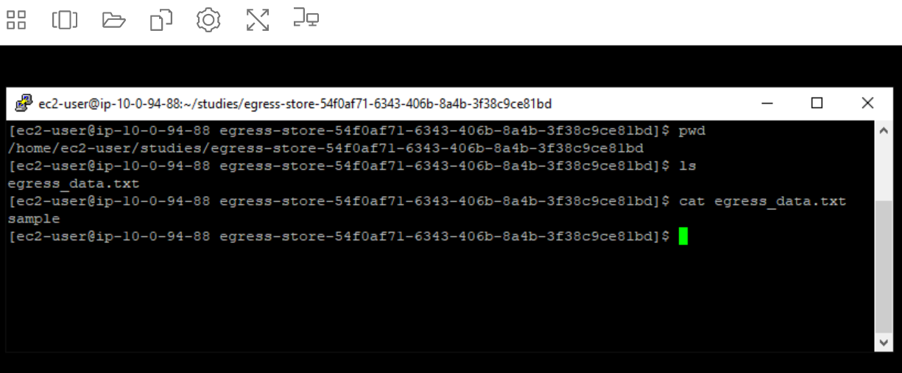

There are 2 types of users involved in the Egress App workflow:
1) Information Governance Leads
- uses a SWB user account of type researcher to create a new workspace to view the contents of the data egress request
- uses an Egress App user account to provide the 1st approval for a data egress request
2) Research IT Admins
- uses a SWB user account of type admin to validate that an information governance lead is authorised to grant their approval
- uses an Egress App user account to provide the 2nd approval for data egress requests, only after the 1st approval has been granted

## Workflow

1) TRE administrator sets up the user accounts as described in the [Configuration Guide](./ConfigurationGuide.md)

2) In the SWB Web App, the Researcher creates and uses a workspace to carry out research activities.

3) In the SWB Web App, the Researcher adds data to the egress store and submits an egress request from the SWB website.

4) The Information Governance Lead receives an email notification about the egress request triggered by the Researcher.

5) In the Egress Web App, the Information Governance Lead views the egress request searching for the ID from the email notification.

5) In the SWB Web App, the Information Governance Lead creates/uses a workspace with the study created in the [Configuration Guide](./ConfigurationGuide.md)

6) In the SWB Web App, the Information Governance Lead connects to the workspace to view the egress request contents searching for the ID from the email notification.

7) In the Egress Web App, the Information Governance Lead approves or rejects the egress request with the ID from the email notification.

8) If the egress request was rejected by the Information Governance Lead, the Researcher and Information Governance Lead will be notified by email.

**The steps below happen only if the egress request was approved by the Information Governance Lead.**

9) If the egress request was approved by the Information Governance Lead, a Research IT Admin will be notified by email.

10) The Research IT Admin needs to check that the Information Governance Lead approval was granted by a person with the required clearance.

11) In the Egress Web App, the Research IT Admin approves or rejects the egress request with the ID from the email notification.

12) If the egress request was rejected by the Research IT Admin, the Researcher and Information Governance Lead will be notified by email.

**The steps below happen only if the egress request was approved by the Research IT Admin.**

13) If the egress request was approved by the Research IT Admin, the Researcher and Information Governance Lead will be notified by email.

14) In the Egress Web App, the Information Governance Lead can download the egress request file contents. The number of times a download is allowed is constrained by a parameter set during the Egress App deployment stage.

15) The Information Governance Lead is responsible for sending the egress request file contents to the Researcher via an approved manual method such as email.
