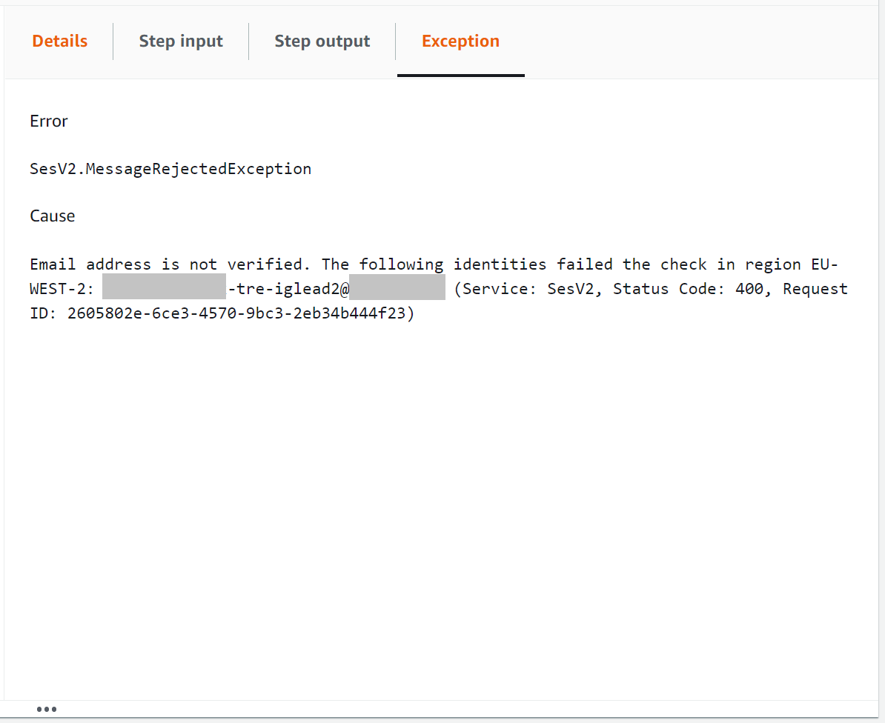
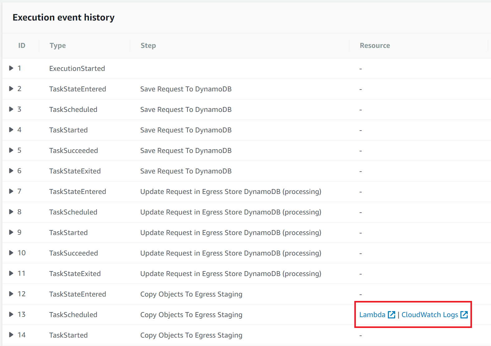
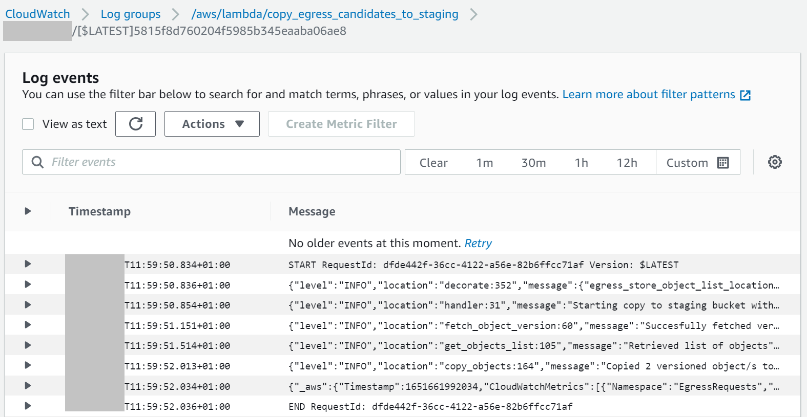

# Troubleshooting Runbook

The guidance below should help troubleshoot common issues identified in the TRE solution.

## AWS Accounts

### Compute service limits

Some services such as AWS Control Tower or Amazon AppStream 2.0 are affected by service limits usually
 affecting new AWS accounts. To fix these availability issues, you can try launching and terminating at
 least one EC2 instance (size of instance and run duration prior to termination do not matter).

## ServiceWorkbench (SWB)

For general guidance on operating the ServiceWorkbench web application, please visit
 the official [documentation page](https://github.com/awslabs/service-workbench-on-aws/tree/v5.1.1/docs).

For known issues affecting the ServiceWorkbench codebase, please visit the official
 [GitHub Issues page](https://github.com/awslabs/service-workbench-on-aws/issues).

### AppStream

### Project Budget Controls

### External Data Studies

## Egress Add-On Application

### Egress Workflow

This section describes troubleshooting steps and tips for the egress workflow (StepFunction tasks).
 The [AWS StepFunctions](https://eu-west-2.console.aws.amazon.com/states/home?region=eu-west-2#/statemachines)
 service should be the first point of contact for any monitoring, debugging or troubleshooting actions.

Below are some debugging steps which can be followed to identify an issue in the egress workflow.
 This includes any errors arising between the time the egress request submission button is clicked in SWB
 to the time the request has been egressed or rejected.

1. Identify the egress request ID which caused the issue. This should be done by visiting the [AWS StepFunctions](https://eu-west-2.console.aws.amazon.com/states/home?region=eu-west-2#/statemachines) service.
 By clicking on the **DataEgressWorkflow** state machine, you will be able to see all of the current and past
 workflow executions. The most recent execution will be listed at the top. Failed executions will be noticeable
 through the execution status, as seen below.

    The Execution ID is the same as the Egress Request ID, a unique 36 character string that can be used to
 identify an egress request. The ID can also be found in the Egress App.

    

1. Once the egress request has been identified, you can click on the execution to view the graph inspector,
 which displays each stage of the worfklow execution. The stages show the order of the workflow and are either
 displayed in green or red to indicate a success or a failure.

    

1. The red stage on the graph indicates that the issue happened during its execution. By clicking on the stage,
 you can analyse details associated with the stage such as the input data supplied to the stage, the data output
 from the stage, and the exception (error logs) produced from the stage. A few examples are shown below.

    

    

1. Below the graph inspector, the execution event history can be used to analyse a timestamped series of events
 from the workflow execution. If the failed stage would involve a Lambda function, the Lambda configurations (code,
 permissions) and logs can be accessed by clicking on the associated links.

    

1. If the root cause has stil not been identified with a Lambda function, further analysis through CloudWatch logs
 will be required. Use the link in the execution event history to access the Lambda log group.

     - Click on the '__Search all__' button and use the '__filter events__' input
     - Pass the __Egress Request ID__ in double quotes and search for
       - e.g. "b0d2aa37-f0b7-4898-98a2-e1d588a2a447"
     - Expand one of the returned event messages to retrieve the __function_request_id__
     - Pass the __function_request_id__ in double quotes and search for
       - e.g. "f7f57dbb-2b1e-43c8-817d-b56a193d785a"
     - Click on any of the log stream names in the returned event messages

    This will display all timestamped log messages output by the Lambda function during execution. All messages will
 be associated with the specified egress request ID.

    Depending on the log level configured, different logs will be visible in CloudWatch. Setting log level to
 DEBUG will provide additional useful information such as the name of the S3 bucket used in the function. Log level
 can be set by passing in the environment variable LOG_LEVEL to the Lambda function.

    

    For additional troubleshooting guidance check the documentation for
 [Lambda functions](https://docs.aws.amazon.com/lambda/latest/dg/lambda-troubleshooting.html)
 and [Appsync APIs](https://docs.aws.amazon.com/appsync/latest/devguide/troubleshooting-and-common-mistakes.html).

### Failure Scenarios

The use of a task token has a side-effect that an egress request can only be updated once for a given token.
 If something were to go wrong in the workflow after the user has made their decision in the front-end, it would
 not be possible for them to save their decision again. If they tried to, they would get a `Null...coerced...` error.
 One way of getting around this without needing the researcher to resubmit their egress request again is to do as follows:
  * In the AWS Step Functions Console, identify and select the execution that has the problem
  * Once inside the chosen execution, click the __New Execution__ button. This will clone the existing
  execution into a new one whilst keeping the same egress request ID.
  * The egress request will be reset back to the **PENDING** state within the Egress App
